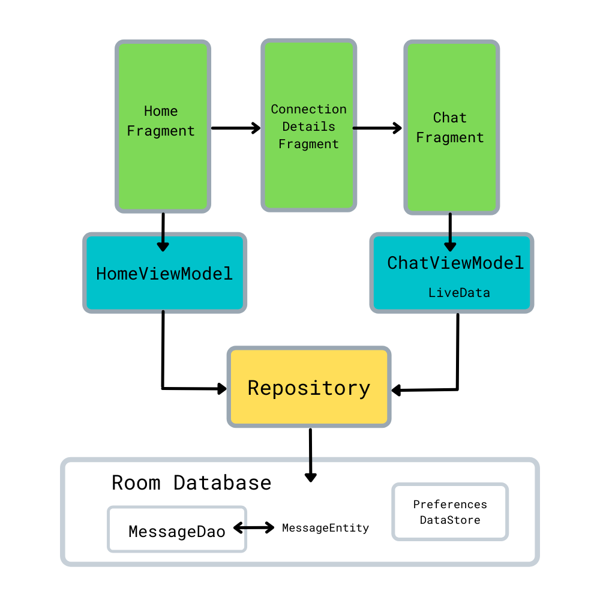
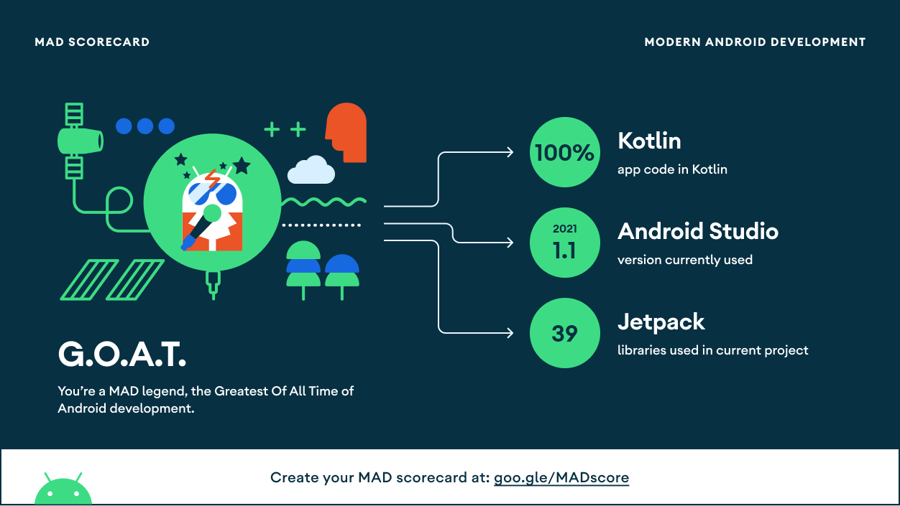
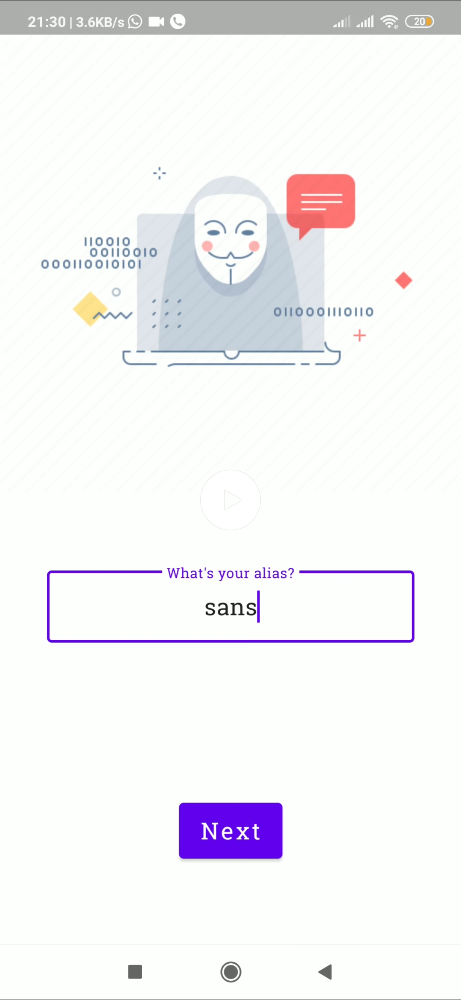
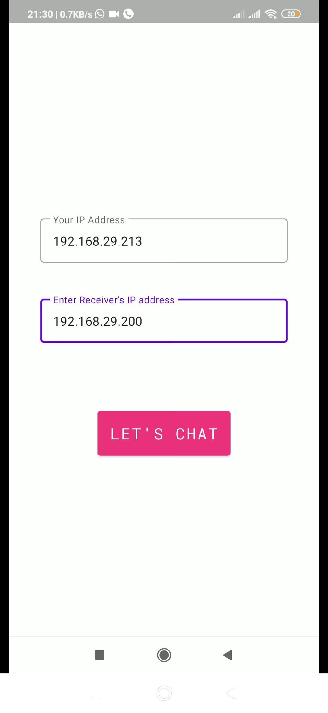
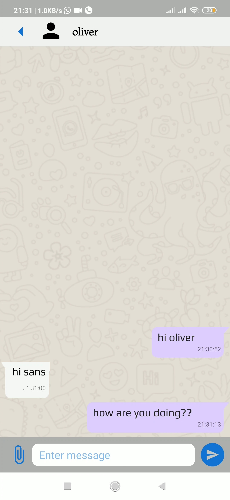
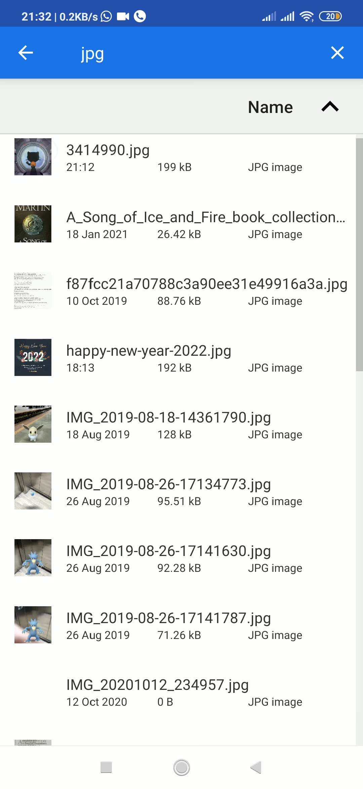
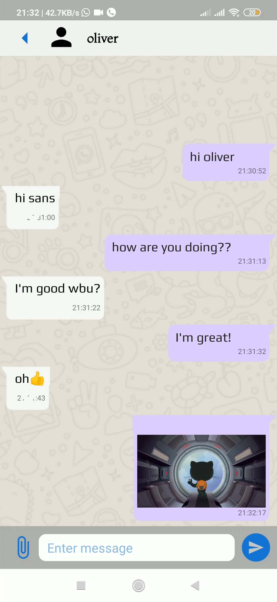
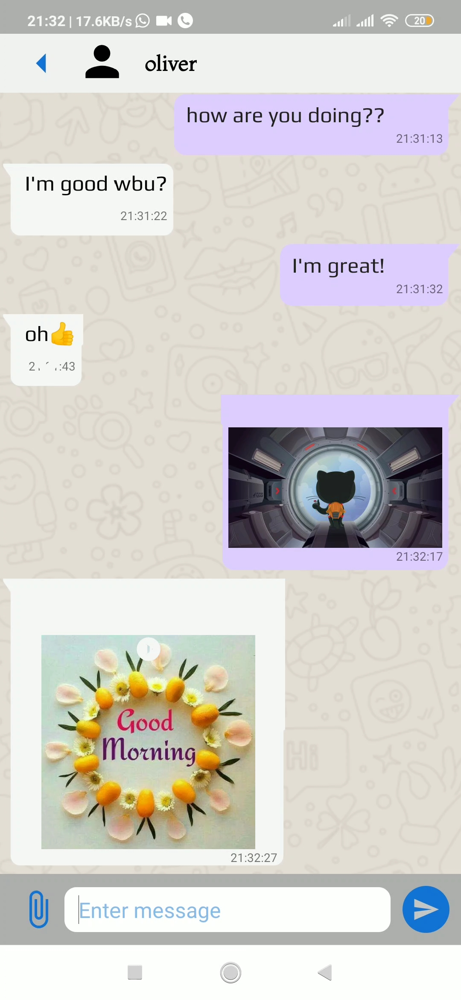

# Knox

<p align="center">
  <a href="https://github.com/pk-218/KotlinX">
    
  </a>
</p>

## 📌 About

Knox is a peer-to-peer mobile chat application that uses no intermediary, no server, ensuring user's privacy and security. This is made possible by sockets to exchange text and files between peers present in the same network.

_**Developed by Team KotlinX**_

- [Azeez Dandawala](https://github.com/azeez-72)
- [Pankaj Khushalani](https://github.com/pk-218)
- [Prasad Thakare](https://github.com/sans2801)
- [Shivam Pawar](https://github.com/theshivv)

## 🎯 Key Features

- Create an alias to ensure privacy

- Send text messages to peers

- Send files such as images, audio, and other documents to peers

- Block a peer from further communication

## 🛠 Project Setup

- Prerequisites

  - Java Development Kit version 8 or higher. Download JDK 11 [here](https://www.oracle.com/in/java/technologies/javase/jdk11-archive-downloads.html).

  - Android Studio Bumblebee or higher installed with Android Gradle Plugin 7.1.4 or higher and Kotlin plguin version 1.5 or higher. Download Android Studio Bumblebee [here](https://developer.android.com/studio).

  - An Android Virtual Device with API level 21 or above to run the mobile application locally or a physical Android device with USB debugging turned on.

- Steps

  1. Clone the GitHub repository using Git.

  ```
  git clone https://github.com/pk-218/KotlinX.git
  ```

  2. Build the project using Gradle CLI

  ```
  ./gradlew build
  ```

  3. Run the project on your virtual or physical Android device.

  ```
  ./gradlew installDebug
  ```

## ⛓ Mobile Application Architecture

Knox follows the single Activity, MVVM (Model-View-ViewModel) architecture. The data stores and sources are interfaces by a repository that is accessed by ViewModels via dependency injection. The ViewModels supply the data to the UI or Views (here, Fragments).

<p align="center">
    
</p>

</br>

## ⚡ Technologies Used

- Kotlin: An open source, modern statically typed programming language used by over 60% of professional Android developers and officially supported by Google since 2019.

- XML: Extensible Markup Language used to defined the views for the Android mobile application.

- Android Studio: THe official integrated development environment for Google's Android operating system, built on JetBrains' IntelliJ IDEA software and designed specifically for Android development.

- Jetpack Libraries:
  A suite of libraries maintained by Google that work consistently across Android versions and devices.

  - Fragment - Allows creation of multiple screens hosted within a single Activity.

  - ViewModel - Designed to store and manage UI-related data in a lifecycle conscious way. The ViewModel class allows data to survive configuration changes such as screen rotations.

  - Room - Provides an abstraction layer over SQLite to allow for more robust database access while harnessing the full power of SQLite.

  - Navigation - Helps implement the Navigation components such as NavHost and NavController.

  - Hilt - Built on top of Jetpack Dagger that provides dependency injection with ease.

  - Preferences DataStore - A data storage solution that allows to store key-value pairs locally using coroutines and Flow.

</br>
  <p align="center">
    
  </p>
</br>

## 📸 Screenshots & Video

Check out the demonstration video [here](https://drive.google.com/file/d/1-oxsrs8NbKyoVPGcngqP7tlPwLVyYqZ1/view?usp=sharing).
</br>

<p align="center">
    
    
    
</p>

<p align="center">
    
    
    
</p>
